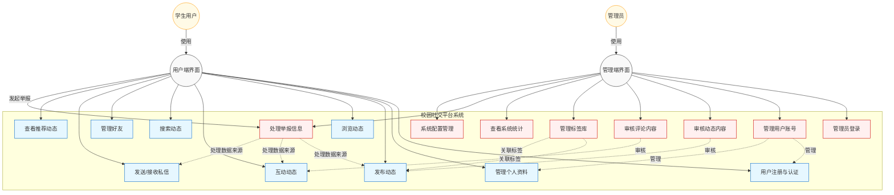
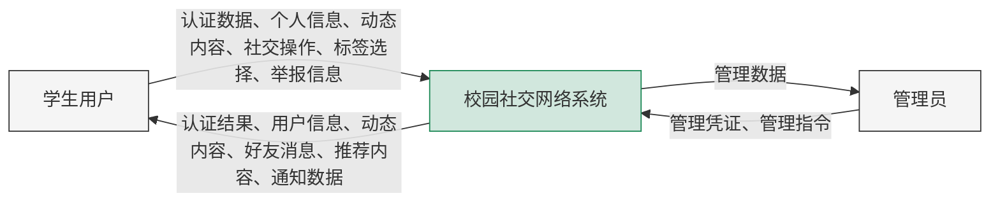
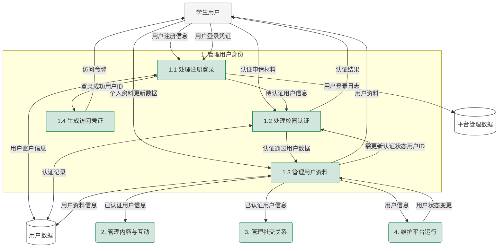
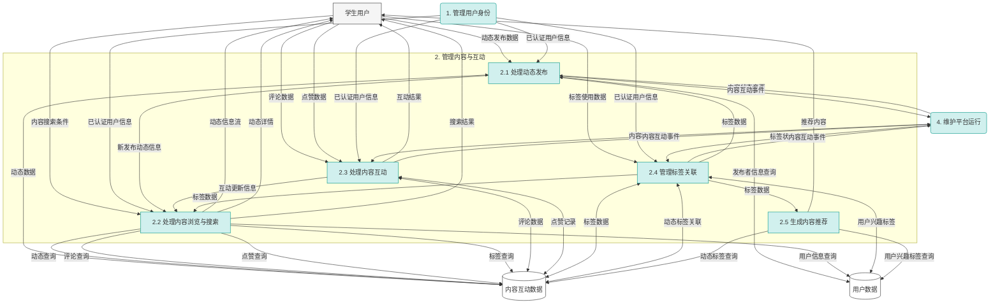
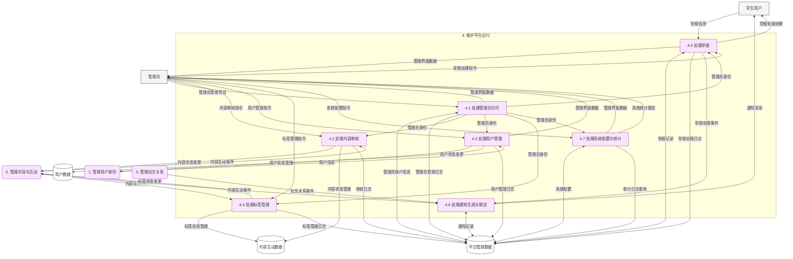
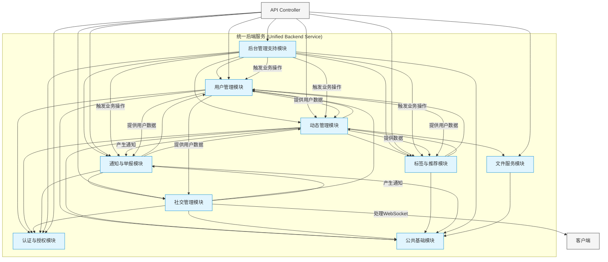

好的，我已经整理了我们讨论的所有内容，并力求语言表达更自然流畅，形成一份完整的系统设计报告。这份报告涵盖了项目的各个方面，从目标、需求到具体的架构、模块和数据库设计，希望能满足你的课程设计要求。

---

**校园社交平台系统设计文档**

**目录**

**第一章 绪论**
    1.1 项目构想与核心价值
    1.2 项目意义与目标

**第二章 需求分析**
    2.1 功能需求分析
        2.1.1 系统参与者
        2.1.2 用例模型
        2.1.3 主要功能需求
    2.2 数据流分析
        2.2.1 顶层数据流图（Level 0 DFD）
        2.2.2 一层数据流图（Level 1 DFD）
    2.3 数据字典 (修订)
        2.3.1 数据流条目 (Data Flow Entries)
        2.3.2 数据元素条目 (Data Element Entries)
        2.3.3 数据存储条目 (Data Store Entries)
    2.4 非功能需求分析

**第三章 系统设计**
    3.1 系统架构设计
        3.1.1 系统架构图
        3.1.2 系统架构图说明
    3.2 技术选型
    3.3 关键设计决策

**第四章 功能模块设计**
    4.1 功能模块划分
        4.1.1 功能模块图
        4.1.2 功能模块图说明
    4.2 模块功能详述

**第五章 数据库设计**
    5.1 数据库 E-R 图 (聚焦 P1/P2，预留扩展)
    5.2 E-R 图说明
    5.3 数据库表结构设计

---

**第一章 绪论**

**1.1 项目构想与核心价值**

在当今数字化的浪潮中，高校校园生活日益丰富多彩，但信息的有效流通和真实的社交连接往往面临挑战。各类信息散布于不同的群聊、公告栏或非专属平台，导致信息碎片化；同时，快节奏的学习生活也让建立深层次、有意义的校园社交关系变得不那么容易。基于这样的观察，我们构想并启动了本项目——一个旨在**打造专属、可信、互联的数字校园空间**的社交平台。

本平台的核心价值在于**整合与连接**。我们希望通过构建一个集**校园动态分享、好友关系管理、即时互动交流**于一体的应用，打破信息孤岛，让学生能够便捷地发现和分享校园内的点滴，无论是学习求助、生活分享、二手交易还是活动通知。更重要的是，我们期望平台能成为促进真实校园社交的催化剂，帮助学生基于共同兴趣和校园身份，建立、维护和深化彼此的联系。平台初期将专注于实现这些核心功能，并通过引入基础的**标签机制**和**内容推荐**，初步探索个性化信息服务的可能。同时，配套的**后台管理系统**将为平台的健康运营提供支撑。

**1.2 项目意义与目标**

开发这样一个校园社交平台，不仅是对现有校园信息与社交模式的一次优化尝试，更具有多方面的积极意义：

1. **提升信息效率：** 为学生提供一个官方认证下的、信息聚合的一站式平台，减少信息获取成本，提高校园资讯的触达率和时效性。
2. **促进社区建设：** 以真实的校园身份为基础，鼓励有价值的内容分享和健康的互动交流，营造积极互助、充满活力的线上社区氛围，增强学生的归属感。
3. **赋能校园生活：** 将信息、社交、互动等功能整合，简化学生的数字生活体验，使其更加便捷和高效。
4. **保障平台环境：** 通过强制校园认证和必要的后台管理（内容审核、用户管理、举报处理），最大限度地保障信息的真实性和社区的安全性。
5. **技术实践平台：** 对开发团队而言，本项目是一个极佳的综合性实践平台，涵盖了从需求分析、架构设计到前后端开发、数据库管理、系统部署与维护的全流程，有助于深化技术理解和提升工程实践能力。

**本项目的主要目标（对应课程设计周期）：**

* 成功开发并上线平台的核心功能（用户认证、动态分享、好友关系、基础 IM、手动标签、简单推荐）的用户端应用。
* 开发并部署一个功能完善的后台管理系统，支持管理员进行用户管理、内容审核、标签管理和举报处理。
* 确保系统稳定、安全、易用，能够吸引并服务于初期目标用户群体。
* 为未来引入更高级功能（如视频社交、活动组织、智能推荐等）奠定坚实的技术和数据基础。

---

**第二章 需求分析**

本章旨在明确系统的核心功能需求和非功能需求，通过建立用例模型、数据流模型和数据字典，为后续的系统设计奠定基础。

**2.1 功能需求分析**

本节将概括系统为学生用户和管理员提供的核心功能。

**2.1.1 系统参与者**

* **学生用户 (Student User):** 使用用户端应用。
* **管理员 (Administrator):** 使用管理端应用。

**2.1.2 用例模型**



**用例图说明:**
上图展示了学生用户通过用户端应用、管理员通过管理端应用与统一后端系统进行交互的核心用例。用户端主要负责信息获取、分享和社交互动，管理端则侧重于平台维护、内容监控和用户管理。举报功能连接了用户（发起）和管理员（处理）。

**2.1.3 主要功能需求**

**A. 认证与账户管理**

* **学生用户:**
  * **注册与登录:** 提供基于学号、密码的注册入口；支持学号/手机/邮箱登录；提供密码找回功能。
  * **校园认证:** 支持通过多种方式（如教务对接、证件上传、邮箱验证）完成校园身份验证，并更新显示认证状态。
  * **个人资料管理:** 允许查看和修改昵称、头像等基础信息；管理个人兴趣标签列表（添加/删除）。
  * **查看他人资料:** 允许查看其他用户的公开信息（昵称、头像、院系、动态列表等）。
  * **账户设置:** 提供基础的隐私和通知偏好设置（如是否允许陌生人消息）。
  * **登出:** 提供安全的登出功能。
* **管理员:**
  * **管理员登录:** 提供基于管理员账户和密码的安全登录入口。
  * **用户查询与管理:** 查看学生用户列表（支持分页、筛选、排序）；查看用户详情；管理用户账号状态（启用/禁用）。
  * **认证审核:** (若采用人工审核) 处理待审核的校园认证请求。

**B. 动态与互动**

* **学生用户:**
  * **发布动态:** 支持发布包含文本、多图片 (`dynamic_media`)、手动标签 (`dynamic_tags`) 的动态；可选可见范围和地点（为扩展预留）。
  * **浏览动态:** 提供按时间排序的动态信息流（区分广场/好友等视图）；支持分页加载。
  * **查看详情:** 查看动态的完整内容、媒体、标签、互动信息及评论列表。
  * **点赞:** 支持对动态和评论进行点赞/取消点赞 (`likes`)。
  * **评论:** 支持对动态发表评论；支持回复他人评论，形成层级结构 (`comments`)。
  * **删除内容:** 允许删除自己发布的动态和评论。
  * **搜索动态:** 支持通过关键词或标签搜索相关动态。
* **管理员:**
  * **内容审核:** 审核待处理的动态和评论，进行通过/拒绝操作，管理其可见状态。
  * **内容管理:** （可选）强制删除违规动态或评论。

**C. 社交关系与通讯**

* **学生用户:**
  * **好友管理:** 支持搜索用户；发送好友请求；处理收到的好友请求（同意/拒绝）；查看好友列表；解除好友关系 (`friendships`)。
  * **即时通讯 (IM):** 支持与好友进行一对一文字聊天 (`private_messages`)；查看聊天记录；（后台需处理在线消息转发与离线消息存储）。
* **管理员:**
  * （暂无直接管理社交关系的核心需求，但可能需要通过用户管理间接处理，如查看用户关系用于问题排查）。

**D. 标签与推荐**

* **学生用户:**
  * **使用标签:** 发布动态时添加标签；点击标签查看相关动态。
  * **管理兴趣标签:** 在个人资料中管理自己的兴趣标签 (`user_interest_tags`)。
  * **查看推荐:** 查看系统基于标签匹配推荐的动态内容。
* **管理员:**
  * **标签库管理:** 查看系统标签列表；添加/编辑/禁用系统预设标签；审核用户创建的新标签 (`tags`)。

**E. 通知与举报**

* **学生用户:**
  * **接收通知:** 接收系统推送的各类通知（如好友请求、评论回复、点赞、系统公告、举报结果等）(`notifications`)；标记已读。
  * **发起举报:** 对不当内容（用户、动态、评论）进行举报，选择原因并提交 (`reports`)。
* **管理员:**
  * **处理举报:** 查看待处理的举报列表；调查核实举报内容；对举报进行处理（标记有效/无效），并采取相应措施（如警告用户、删除内容、禁用账号）；（可选）反馈处理结果给举报者 (`reports`)。

**F. 后台基础管理**

* **管理员:**
  * **操作日志:** (后台记录) 关键管理操作应被记录，便于审计 (`audit_logs`)。
  * **系统配置:** (可选) 管理部分系统级配置参数（如默认设置、功能开关等）(`system_configs`)。
  * **基础统计:** (可选) 查看平台基础运营数据概览（如用户数、日活、动态数等）。

**2.2 数据流分析**

数据流图（Data Flow Diagram, DFD）用于描述系统内数据的流动和处理过程。

**2.2.1 顶层数据流图（Level 0 DFD）**



**顶层数据流图说明:**
此图展示了系统的整体数据流，学生用户和管理员作为外部实体与社交平台系统交互。学生用户向系统提供认证数据、个人信息、动态内容、社交操作、标签选择和举报信息；系统向学生用户返回认证结果、用户信息、动态内容、好友消息、推荐内容和通知数据。管理员向系统提供管理凭证和管理指令，系统向管理员返回管理数据。

**2.2.2 第1层数据流图 (Level 1 DFD)**

第1层数据流图展示了系统的主要功能模块及其数据交互。每个数据流都表示纯数据的传递，不包含处理逻辑。

```mermaid
graph TD
    classDef external fill:#f5f5f5,stroke:#333,stroke-width:1px,rounded
    classDef process fill:#d1e7dd,stroke:#198754,stroke-width:1px,rounded
    classDef datastore fill:#fff,stroke:#333,stroke-width:1px,shape:cylinder

    %% 外部实体
    E1[学生用户]:::external
    E2[管理员]:::external

    %% 处理过程 (Level 1)
    P1[1. 管理用户身份]:::process
    P2[2. 管理内容与互动]:::process
    P3[3. 管理社交关系]:::process
    P4[4. 维护平台运行]:::process

    %% 数据存储 (Level 1 - 概念聚合)
    DS_User[(用户数据)]:::datastore
    DS_Content[(内容互动数据)]:::datastore
    DS_Social[(社交关系数据)]:::datastore
    DS_Platform[(平台管理数据)]:::datastore

    %% 数据流：外部实体 <-> 处理过程 (纯数据)
    E1 -->|用户注册信息| P1
    E1 -->|用户登录凭证| P1
    E1 -->|个人资料更新数据| P1
    E1 -->|认证申请材料| P1
    P1 -->|认证结果| E1
    P1 -->|用户资料| E1
    P1 -->|访问令牌| E1

    E1 -->|动态发布数据| P2
    E1 -->|内容搜索条件| P2
    E1 -->|评论数据| P2
    E1 -->|点赞数据| P2
    E1 -->|标签使用数据| P2
    P2 -->|动态信息流| E1
    P2 -->|动态详情| E1
    P2 -->|搜索结果| E1
    P2 -->|互动结果| E1
    P2 -->|推荐内容| E1

    E1 -->|好友操作数据| P3
    E1 -->|私信内容| P3
    P3 -->|好友列表| E1
    P3 -->|好友请求| E1
    P3 -->|私信消息| E1

    E1 -->|举报信息| P4
    P4 -->|通知消息| E1
    P4 -->|举报处理结果| E1

    E2 -->|管理员登录凭证| P4
    E2 -->|用户管理指令| P4
    E2 -->|内容审核指令| P4
    E2 -->|标签管理指令| P4
    E2 -->|举报处理指令| P4
    E2 -->|系统配置指令| P4
    P4 -->|管理界面数据| E2
    P4 -->|系统统计报告| E2

    %% 数据流：处理过程 <-> 数据存储 (纯数据)
    P1 <-->|用户账户信息| DS_User
    P1 <-->|用户资料信息| DS_User
    P1 <-->|认证记录| DS_User
    P1 -->|用户登录日志| DS_Platform

    P2 <-->|动态数据| DS_Content
    P2 <-->|评论数据| DS_Content
    P2 <-->|点赞记录| DS_Content
    P2 <-->|标签数据| DS_Content
    P2 -->|用户信息查询| DS_User

    P3 <-->|好友关系数据| DS_Social
    P3 <-->|私信记录| DS_Social
    P3 -->|用户信息查询| DS_User

    P4 <-->|管理员账户信息| DS_Platform
    P4 <-->|举报记录| DS_Platform
    P4 <-->|通知记录| DS_Platform
    P4 <-->|系统配置| DS_Platform
    P4 <-->|审计日志| DS_Platform
    P4 -->|用户信息管理| DS_User
    P4 -->|内容状态管理| DS_Content
    P4 -->|标签信息管理| DS_Content

    %% 数据流：处理过程 <-> 处理过程 (纯数据)
    P1 -->|已认证用户信息| P2
    P1 -->|已认证用户信息| P3
    P1 -->|用户信息| P4

    P2 -->|内容互动事件| P4
    P3 -->|社交关系事件| P4
    P4 -->|用户状态变更| P1
    P4 -->|内容状态变更| P2
    P4 -->|标签状态变更| P2
```



**2.2.3 第1层数据流图说明 (修订)**

此修订版的Level 1 DFD将系统核心功能划分为四大处理过程：

1.  **管理用户身份 (P1):** 负责用户的注册、登录、个人资料（查看、修改）、设置、校园认证等身份相关的所有操作。
2.  **管理内容与互动 (P2):** 负责动态的发布、浏览、搜索，评论和点赞等互动行为，以及标签的关联和内容的推荐。
3.  **管理社交关系 (P3):** 负责好友关系的建立、维护、解除，以及用户间的私信通讯。
4.  **维护平台运行 (P4):** 包含所有后台管理功能（管理员登录、用户管理、内容审核、标签管理、举报处理、系统配置、统计查看）以及面向用户的通知生成与推送等支撑性功能。

数据存储也相应聚合为四大类：用户数据、内容互动数据、社交关系数据和平台管理数据。数据流严格遵循纯数据原则，清晰展示了外部实体、处理过程和数据存储之间的数据交换关系，以及处理过程之间的必要数据交互。

**2.2.4 第2层数据流图 - P1 管理用户身份**

此图分解展示了"管理用户身份"过程的内部细节。


**说明:** P1过程被分解为处理注册登录、处理校园认证、管理用户资料和生成访问凭证四个子过程。它们接收来自用户和P4的数据，与其他Level 1过程交互认证后的用户信息，并读写用户数据和平台管理数据（日志）。

**2.2.5 第2层数据流图 - P2 管理内容与互动**

此图分解展示了"管理内容与互动"过程的内部细节。


**说明:** P2过程分解为处理动态发布、内容浏览搜索、内容互动、标签关联和内容推荐五个子过程。接收用户输入和来自P1/P4的数据，向用户输出内容，向P4发送事件，并读写用户数据和内容互动数据。

**2.2.6 第2层数据流图 - P3 管理社交关系**

此图分解展示了"管理社交关系"过程的内部细节。

```mermaid
graph TD
    classDef external fill:#f5f5f5,stroke:#333,stroke-width:1px,rounded
    classDef process fill:#d1f0ee,stroke:#009688,stroke-width:1px,rounded
    classDef datastore fill:#fff,stroke:#333,stroke-width:1px,shape:cylinder

    %% 外部实体/数据存储/其他Level 1过程
    E1[学生用户]:::external
    P1(1. 管理用户身份):::process
    P4(4. 维护平台运行):::process
    DS_User[(用户数据)]:::datastore
    DS_Social[(社交关系数据)]:::datastore

    subgraph P3 [3. 管理社交关系]
        P3_1[3.1 处理好友关系]:::process
        P3_2[3.2 处理私信通讯]:::process
    end

    %% 输入数据流 (来自Level 0/1)
    E1 -->|好友操作数据| P3_1
    E1 -->|私信内容| P3_2
    P1 -->|已认证用户信息| P3_1
    P1 -->|已认证用户信息| P3_2

    %% 输出数据流 (去往Level 0/1)
    P3_1 -->|好友列表| E1
    P3_1 -->|好友请求| E1
    P3_2 -->|私信消息| E1
    P3_1 -->|社交关系事件| P4

    %% 与数据存储的交互
    P3_1 <-->|好友关系数据| DS_Social
    P3_1 -->|用户信息查询| DS_User
    P3_2 <-->|私信记录| DS_Social
    P3_2 -->|收发方信息查询| DS_User

    %% 内部数据流 (可能简单到不需要)
    // P3_1 -->|好友关系信息| P3_2
```
**说明:** P3过程分解为处理好友关系和处理私信通讯两个子过程。接收用户输入和P1的用户信息，向用户输出好友和消息数据，向P4发送事件，并读写用户数据和社交关系数据。

**2.2.7 第2层数据流图 - P4 维护平台运行**

此图分解展示了"维护平台运行"过程的内部细节。


**说明:** P4 过程作为核心的后台和支撑模块，被分解为处理管理员访问、内容审核、用户管理、标签管理、举报处理、通知生成推送以及系统配置统计七个子过程。它接收来自用户、管理员和其他Level 1过程的数据/事件，向用户和管理员输出结果/数据，并与其他Level 1过程交互状态变更信息，同时读写所有类型的数据存储。

**2.3 数据字典 (修订)**

数据字典详细定义了系统中使用的各类数据。为保持与数据流图的一致性，数据字典采用分层描述方式。

**2.3.1 数据流条目 (Data Flow Entries)**

*(基于修订后的Level 1 DFD和Level 2 DFD重新编写和组织)*

| 数据流名称         | 描述                             | 来源       | 去向       | 数据结构 (示例)                                      |
|:-----------------|:---------------------------------|:-----------|:-----------|:-----------------------------------------------------|
| **Level 1 数据流** |                                  |            |            |                                                      |
| 用户注册信息      | 用户注册时提交的必要信息            | E1         | P1         | `{ student_id, password, nickname }`               |
| 用户登录凭证      | 用户登录时提供的身份验证信息         | E1         | P1         | `{ identifier, password }`                             |
| 个人资料更新数据    | 用户修改个人资料时提交的数据           | E1         | P1         | `{ nickname?, avatar_url?, gender?, department?, grade? }`|
| 认证申请材料      | 用户申请校园认证时提交的材料         | E1         | P1         | `{ proof_type, proof_data }`                       |
| 认证结果         | 系统返回给用户的校园认证状态和信息       | P1         | E1         | `{ user_id, auth_status, message? }`                 |
| 用户资料         | 系统向用户展示的个人公开或私有信息      | P1         | E1         | `{ profile: {...}, settings: {...} }`              |
| 访问令牌         | 登录成功后系统颁发给用户的token        | P1         | E1         | `{ token, expires_at, user_basic_info }`             |
| 动态发布数据      | 用户发布新动态时提交的数据            | E1         | P2         | `{ content, media_urls: [], tag_names: [], visibility, type }`|
| 内容搜索条件      | 用户搜索动态时使用的关键字或标签等      | E1         | P2         | `{ keyword?, tag_id?, page, size, sort }`          |
| 评论数据         | 用户发表评论时提交的数据             | E1         | P2         | `{ dynamic_id, content, parent_comment_id? }`      |
| 点赞数据         | 用户点赞或取消点赞的操作数据          | E1         | P2         | `{ target_id, target_type, action: 'LIKE/UNLIKE' }`|
| 标签使用数据      | 用户给动态打标签或管理个人兴趣标签的数据   | E1         | P2         | `{ target_type: 'DYNAMIC'/'USER', target_id?, tag_names: [], action: 'ADD'/'REMOVE' }` |
| 动态信息流        | 系统向用户展示的动态列表数据           | P2         | E1         | `{ dynamics: [...], pagination: {...} }`           |
| 动态详情         | 系统向用户展示的单个动态的详细信息       | P2         | E1         | `{ dynamic_data, comments: [...], like_count }`    |
| 搜索结果         | 根据搜索条件返回的动态列表           | P2         | E1         | `{ dynamics: [...], pagination: {...} }`           |
| 互动结果         | 点赞或评论操作成功与否的反馈         | P2         | E1         | `{ success, message? }`                              |
| 推荐内容         | 系统根据算法推荐给用户的动态列表       | P2         | E1         | `{ recommended_dynamics: [...] }`                  |
| 好友操作数据      | 用户进行添加/同意/拒绝/删除好友的操作数据 | E1         | P3         | `{ target_user_id, action: 'ADD/ACCEPT/REJECT/REMOVE' }` |
| 私信内容         | 用户发送的私信文本或媒体信息          | E1         | P3         | `{ receiver_id, content, content_type }`             |
| 好友列表         | 用户当前的好友名单                 | P3         | E1         | `{ friends: [...] }`                                 |
| 好友请求         | 其他用户发来的待处理好友请求         | P3         | E1         | `{ friend_requests: [...] }`                         |
| 私信消息         | 用户收到的新的或历史私信             | P3         | E1         | `{ messages: [...] }`                                |
| 举报信息         | 用户提交的对不良内容的举报数据        | E1         | P4         | `{ target_id, target_type, reason_type, reason_detail? }`|
| 通知消息         | 系统推送给用户的各类通知             | P4         | E1         | `{ notifications: [...] }`                           |
| 举报处理结果      | 系统告知用户其举报的处理情况反馈        | P4         | E1         | `{ report_id, result_status, message? }`           |
| 管理员登录凭证    | 管理员登录后台时使用的账号密码        | E2         | P4         | `{ username, password }`                             |
| 用户管理指令      | 管理员对用户账号进行操作的指令        | E2         | P4         | `{ user_id, action: 'DISABLE/ENABLE/DELETE', reason? }`|
| 内容审核指令      | 管理员对动态或评论进行审核的操作指令     | E2         | P4         | `{ target_id, target_type, decision: 'APPROVE/REJECT', reason? }`|
| 标签管理指令      | 管理员对标签进行创建/审核/禁用等操作指令 | E2         | P4         | `{ tag_id?, tag_name?, action: 'CREATE/APPROVE/DISABLE/EDIT' }`|
| 举报处理指令      | 管理员处理举报的操作命令             | E2         | P4         | `{ report_id, action: 'VALID/INVALID', result_desc?, penalty? }`|
| 系统配置指令      | 管理员修改系统参数的指令            | E2         | P4         | `{ config_key, config_value }`                     |
| 管理界面数据      | 系统向管理员展示的后台管理信息         | P4         | E2         | `{ section: 'users/posts/reports', data: [...], counts: {...} }`|
| 系统统计报告      | 系统生成的运营数据统计结果           | P4         | E2         | `{ daily_active_users, new_users, posts_per_day, ... }`|
| 用户账户信息      | 与用户登录认证相关的核心数据          | P1         | DS_User    | `{ user_id, student_id, password_hash, role, account_status, auth_status }`|
| 用户资料信息      | 用户的详细个人信息和设置            | P1         | DS_User    | `{ user_id, nickname, avatar_url, gender, department, grade, settings_json }`|
| 认证记录         | 用户的校园认证历史或状态信息          | P1         | DS_User    | `{ user_id, proof_data, status, verified_at? }`        |
| 用户登录日志      | 记录用户登录行为的日志数据           | P1         | DS_Platform| `{ log_id, user_id, ip_address, timestamp, success }`|
| 动态数据         | 存储在数据库中的动态核心信息          | P2         | DS_Content | `{ dynamic_id, user_id, content, type, visibility, status, location?, created_at }`|
| 评论数据         | 存储在数据库中的评论信息             | P2         | DS_Content | `{ comment_id, dynamic_id, user_id, content, parent_id?, status, created_at }`|
| 点赞记录         | 存储用户点赞行为的数据              | P2         | DS_Content | `{ like_id, target_id, target_type, user_id, created_at }`|
| 标签数据         | 存储在数据库中的标签信息             | P2         | DS_Content | `{ tag_id, name, type, status, creator_id?, reference_count }`|
| 好友关系数据      | 存储在数据库中的用户间好友关系        | P3         | DS_Social  | `{ relation_id, user1_id, user2_id, status, created_at, updated_at }`|
| 私信记录         | 存储在数据库中的用户私信消息          | P3         | DS_Social  | `{ message_id, conversation_id, sender_id, receiver_id, content, content_type, read_status, created_at }`|
| 管理员账户信息    | 存储在数据库中的管理员账号数据        | P4         | DS_Platform| `{ admin_id, username, password_hash, role, status }`|
| 举报记录         | 存储在数据库中的用户举报信息          | P4         | DS_Platform| `{ report_id, reporter_id, target_id, target_type, reason_type, reason_detail?, status, handler_admin_id?, handle_result?, ... }`|
| 通知记录         | 存储在数据库中的系统通知信息          | P4         | DS_Platform| `{ notification_id, receiver_id, type, title?, content, related_entity_id?, related_entity_type?, read_status, created_at }`|
| 系统配置         | 存储在数据库中的系统参数            | P4         | DS_Platform| `{ config_key, config_value, description }`            |
| 审计日志         | 记录管理员关键操作的日志数据          | P4         | DS_Platform| `{ log_id, admin_id, action, target_entity?, details, ip_address, timestamp }`|
| 用户信息查询      | 从用户数据存储中查询用户信息的请求      | P2, P3     | DS_User    | `{ user_id }` or `{ user_ids: [] }`                  |
| 用户信息管理      | 对用户数据存储进行增删改的操作        | P4         | DS_User    | `{ user_id, update_data: {...} }`                    |
| 内容状态管理      | 对内容数据存储进行状态更新的操作       | P4         | DS_Content | `{ target_id, target_type, new_status }`             |
| 标签信息管理      | 对标签数据存储进行增删改的操作        | P4         | DS_Content | `{ tag_id?, update_data: {...} }`                    |
| 已认证用户信息     | 包含用户ID和认证状态/权限的信息       | P1         | P2, P3, P4 | `{ user_id, role, auth_status }`                     |
| 内容互动事件      | 内容创建、互动产生的需后续处理的事件      | P2         | P4         | `{ event_type: 'NEW_POST'/'NEW_COMMENT'/'NEW_LIKE'/'NEW_TAG', data: {...} }` |
| 社交关系事件      | 好友关系变更产生的需后续处理的事件      | P3         | P4         | `{ event_type: 'FRIEND_REQUEST'/'REQUEST_ACCEPTED', data: {...} }` |
| 用户状态变更      | 管理员操作导致的用户账号状态变化        | P4         | P1         | `{ user_id, new_account_status, reason? }`           |
| 内容状态变更      | 管理员审核导致的内容状态变化          | P4         | P2         | `{ target_id, target_type, new_status, reason? }`    |
| 标签状态变更      | 管理员管理导致标签的状态变化          | P4         | P2         | `{ tag_id, new_status, reason? }`                  |
| **Level 2 内部数据流 (部分示例)** |                                  |            |            |                                                      |
| 待认证用户信息     | 注册后或登录后需要进行认证的用户ID/学号  | P1_1       | P1_2       | `{ user_id, student_id? }`                           |
| 登录成功用户ID     | 成功登录用户的唯一标识符             | P1_1       | P1_4       | `{ user_id, role }`                                  |
| 认证通过用户数据    | 经过认证确认的用户核心数据           | P1_2       | P1_3       | `{ user_id, auth_status, department?, grade? }`      |
| 互动更新信息      | 点赞/评论后需要更新的统计信息等       | P2_3       | P2_2       | `{ target_id, target_type, like_count?, comment_count? }` |
| 管理员身份       | 经过验证的管理员身份信息（用于授权）    | P4_1       | P4_2-7     | `{ admin_id, role }`                                 |
| 举报处理事件      | 举报处理完成后触发的事件（如发通知）    | P4_5       | P4_6       | `{ event_type: 'REPORT_PROCESSED', report_data: {...} }`|

**2.3.2 数据元素条目 (Data Element Entries)**

*(基本保持不变，关键元素已包含在数据流条目示例中，此处省略以避免冗余，实际报告应包含完整列表)*

**2.3.3 数据存储条目 (Data Store Entries)**

| 数据存储名称     | 描述                                   | 主要包含的表 (参考数据库设计章节)                                                                                             | 主要访问过程 (Level 1) |
|:-------------|:---------------------------------------|:--------------------------------------------------------------------------------------------------------------------------|:-----------------|
| 用户数据       | 存储用户账户、个人资料、设置、认证信息等           | `users`, `user_settings`, `user_auth_history`                                                                 | P1, P2, P3, P4     |
| 内容互动数据    | 存储动态、评论、点赞、标签及关联关系等          | `dynamics`, `dynamic_media`, `comments`, `likes`, `tags`, `dynamic_tags`, `user_interest_tags`                        | P2, P4           |
| 社交关系数据    | 存储好友关系、私信消息等                   | `friendships`, `private_messages`                                                                                     | P3               |
| 平台管理数据    | 存储管理员信息、系统配置、通知、举报、日志等      | `admins`, `system_configs`, `notifications`, `reports`, `audit_logs` (以及 `user_auth_history` 中的登录日志部分) | P1, P4           |

**2.4 非功能需求分析**

除了核心功能外，系统还需满足以下非功能性需求：

1. **性能:**
   * 信息流加载、页面切换响应迅速，核心操作（点赞、评论、发消息）延迟低。
   * 系统能够支撑初期目标并发用户量（例如 100-500 并发请求），并具备水平扩展能力。
   * 数据库查询经过优化，避免慢查询。
2. **可用性:**
   * 用户端界面简洁直观，符合移动端用户习惯，易于上手。
   * 管理端界面清晰高效，便于管理员执行管理任务。
   * 系统保持高可用性，重要功能有降级或冗余考虑（远期）。
3. **安全性:**
   * 用户密码、敏感信息需加密存储和传输（HTTPS）。
   * 严格的认证授权机制，区分用户和管理员权限，防范未授权访问。
   * 防御常见的 Web 攻击（SQL注入, XSS, CSRF 等）。
   * 可靠的校园认证机制，防止身份伪造。
   * 有效的内容过滤和审核机制，结合用户举报，管理不当信息。
   * 保护用户隐私数据，遵守相关法律法规。
4. **可扩展性:**
   * 系统架构设计清晰，模块化程度高，便于未来增加新功能（如视频、群组、活动、LBS 等）。
   * 数据库设计具有前瞻性，预留扩展点，减少未来大规模重构的需要。
   * 易于通过增加服务器实例进行水平扩展。
5. **可维护性:**
   * 代码遵循统一的编码规范，结构清晰，注释充分。
   * 具备日志记录能力，便于问题排查和监控。
   * 关键模块应有单元测试和集成测试覆盖。
   * 部署流程自动化、标准化（如使用 Docker）。

---

好的，我们继续完成系统设计报告的剩余部分。

---

**第三章 系统设计** (续)

**3.1.1 系统架构图** (续)

```mermaid
graph TD
    subgraph "用户界面层 (User Interface Layer)"
        UserFE[用户端 Frontend (Vue.js)]
        AdminFE[管理端 Frontend (Vue.js)]
    end

    subgraph "接入与网关层 (Access & Gateway Layer)"
        GW(API 网关 / Nginx)
    end

    subgraph "应用层 (Application Layer - Unified Spring Boot Backend)"
        Backend{统一后端服务}

        subgraph "后端内部逻辑分层"
            Controller(Controller - API Endpoints)
            Service(Service - 业务逻辑)
            DAL(DAL - 数据访问)
        end

        Controller --> Service
        Service --> DAL
        %% 内部模块划分 (逻辑上的，非物理)
        Service -- Contains --> S1[用户服务]
        Service -- Contains --> S2[动态服务]
        Service -- Contains --> S3[社交服务]
        Service -- Contains --> S4[标签推荐服务]
        Service -- Contains --> S5[通知举报服务]
        Service -- Contains --> S6[认证授权服务]
        Service -- Contains --> S7[文件服务]
        Service -- Contains --> S8[后台管理服务]
    end

    subgraph "数据存储层 (Data Persistence Layer)"
        DB[(MySQL 数据库)]
        Cache[(Redis 缓存)]
        OS[(对象存储服务)]
    end

    subgraph "基础设施/支撑服务 (Infrastructure - 远期)"
        MQ[(消息队列)]
        ES[(搜索引擎)]
        RTC[(WebRTC服务)]
        Push[(推送服务)]
        Geo[(地理空间数据库/服务)]
    end

    UserFE -- HTTP/HTTPS API Calls --> GW
    AdminFE -- HTTP/HTTPS API Calls --> GW
    GW -- Routes Requests --> Backend

    Backend -- Handles WebSocket (IM) --> UserFE

    DAL -- SQL --> DB
    Service -- Cache Operations --> Cache
    S7 -- Interacts with --> OS

    %% 远期扩展
    Service -.-> MQ
    Service -.-> ES
    Service -.-> RTC
    Service -.-> Push
    Service -.-> Geo

    %% 添加样式
    classDef storage fill:#ddd,stroke:#333,stroke-width:1px
    classDef service fill:#f9f,stroke:#333,stroke-width:1px
    class Backend service
    class DB,Cache,OS,MQ,ES,RTC,Push,Geo storage
```

**3.1.2 系统架构图说明:**

1. **用户界面层:** 包含两个独立的 Vue.js 前端应用：`UserFE` 面向学生用户，提供社交、信息分享等功能；`AdminFE` 面向管理员，提供后台管理功能。
2. **接入与网关层:** Nginx 或 API 网关作为统一入口，处理所有来自前端的 HTTP/HTTPS 请求，负责反向代理、负载均衡（未来扩展）、SSL 证书管理，并将请求根据路径或其他规则路由到后端服务。
3. **应用层:**
   * 核心是**统一的 Spring Boot 后端服务** (`Backend`)。它承载了所有的业务逻辑和数据处理。
   * 内部采用经典的三层架构：
     * **Controller:** 负责接收 HTTP 请求，解析参数，调用 Service 层处理业务，并封装响应返回给前端。为用户端和管理端提供不同的 API Endpoints (例如通过 `/api/user/**` 和 `/api/admin/**` 区分)。同时，包含处理 WebSocket 连接的逻辑，主要服务于用户端的即时通讯。
     * **Service:** 实现具体的业务逻辑。逻辑上划分为多个服务模块 (S1-S8)，如用户服务、动态服务、社交服务、标签推荐服务、通知举报服务、认证授权服务、文件服务和后台管理服务。这些模块在单体应用内部协作，处理各自领域的业务规则。
     * **DAL (Data Access Layer):** 数据访问层，负责与数据库和缓存进行交互。使用 ORM 框架（如 Spring Data JPA 或 MyBatis）封装对 MySQL 的操作，并使用 RedisTemplate 或类似工具操作 Redis 缓存。
4. **数据存储层:**
   * **MySQL 数据库:** 作为主持久化存储，存储所有结构化业务数据（用户信息、动态、关系、消息、标签、通知、举报、配置等）。
   * **Redis 缓存:** 用于缓存热点数据（如用户信息、动态列表、标签）、存储 Session 信息（如果需要）、管理 WebSocket 连接状态、实现简单的消息队列（如通知推送触发）等，以提升性能和降低数据库压力。
   * **对象存储服务 (OS):** 用于存储用户上传的图片、未来可能的视频等非结构化静态文件，与应用服务器分离，便于管理和扩展。可选用云服务 (OSS, S3) 或自建 (MinIO)。
5. **基础设施/支撑服务 (远期):** (图中虚线表示) 为未来功能扩展预留的技术组件，例如：
   * **消息队列 (MQ):** 用于系统解耦、异步处理、流量削峰（如大规模通知推送、复杂计算任务）。
   * **搜索引擎 (ES):** 提供更强大的全文搜索能力和支持更复杂的推荐算法。
   * **WebRTC 服务:** 支持陌生人视频匹配、音视频通话功能所需的技术栈。
   * **推送服务:** 对接第三方推送平台，实现 App 的离线消息推送。
   * **地理空间数据库/服务 (Geo):** 支持 LBS 相关功能（如附近的人/动态）所需的数据存储和查询能力。

**架构优势:**

* **前后端分离:** 职责清晰，便于团队协作和技术选型。
* **统一后端:** 简化开发、部署和维护，保证数据一致性。
* **分层架构:** 后端内部结构清晰，模块化设计易于理解和扩展。
* **技术栈成熟:** Spring Boot + Vue + MySQL + Redis 是业界广泛使用的组合，生态完善。
* **可扩展性:** 单体架构易于初期快速开发，内部模块化和对缓存、对象存储的使用为未来向微服务演进或引入新基础设施提供了基础。

**3.2 技术选型**

基于项目需求、开发周期、团队熟悉度和未来扩展性考虑，确定以下主要技术栈：

* **后端:**
  * **核心框架:** Spring Boot 3.x (Java 17+)
  * **数据库:** MySQL 8.x
  * **数据访问:** Spring Data JPA (简化 CRUD 和查询) / 或 MyBatis (灵活控制 SQL)
  * **缓存:** Redis (集成 Spring Boot Data Redis)
  * **安全框架:** Spring Security 6.x (处理认证、授权、CSRF 防护等)
  * **认证机制:** JWT (JSON Web Token)
  * **WebSocket:** Spring WebSocket (用于 IM)
  * **对象存储客户端:** AWS SDK for Java (操作 S3 或兼容服务如 MinIO) / Aliyun OSS SDK / Qiniu SDK
  * **构建工具:** Maven / Gradle
  * **API 文档:** SpringDoc OpenAPI (替代 Swagger2)
* **前端 (用户端 & 管理端):**
  * **核心框架:** Vue 3.x
  * **UI 组件库:** Element Plus
  * **状态管理:** Pinia
  * **路由:** Vue Router
  * **HTTP 请求库:** Axios
  * **构建工具:** Vite
* **数据库连接池:** HikariCP (Spring Boot 默认)
* **服务器环境:**
  * **操作系统:** Linux (如 Ubuntu, CentOS)
  * **Web 服务器/反向代理:** Nginx
  * **容器化:** Docker, Docker Compose (用于开发和部署)
* **版本控制:** Git, GitHub/Gitee

**3.3 关键设计决策**

1. **认证与授权:**
   * **统一认证，角色区分:** 后端提供统一的认证服务，通过登录接口区分用户和管理员，颁发包含用户 ID 和 **明确角色** (如 `ROLE_STUDENT`, `ROLE_ADMIN`) 的 JWT。
   * **基于角色的访问控制 (RBAC):** 利用 Spring Security，对所有需要保护的 API Endpoints 实施严格的基于角色的访问控制。管理端 API 必须要求 `ROLE_ADMIN` 权限。
   * **校园认证集成:** 优先考虑对接学校官方接口实现自动化认证。若不可行，则设计安全可靠的学生证上传审核流程或邮箱验证流程。认证结果存储在 `users.auth_status` 字段。
2. **API 设计:**
   * 遵循 RESTful 设计原则，使用标准的 HTTP 方法 (GET, POST, PUT, DELETE)。
   * 使用清晰、一致的 URL 命名规范，并通过路径前缀 (如 `/api/user`, `/api/admin`) 区分面向不同前端的 API。
   * 定义统一的 API 响应格式，包含状态码、消息和数据体。
   * 使用 OpenAPI (通过 SpringDoc) 自动生成 API 文档，便于前后端协作。
3. **即时通讯 (IM):**
   * 使用 WebSocket 实现客户端与服务器之间的全双工长连接。
   * 后端维护一个映射关系（如 Redis 存储 `userId -> WebSocketSessionId`），用于定向推送消息。
   * 点对点消息：发送时查找接收方的 Session 进行推送，同时持久化到 `private_messages` 表。
   * 离线消息：用户上线时，从数据库拉取其离线期间收到的消息。
   * 消息已读状态：客户端发送已读回执，后端更新 `private_messages.read_status`。
4. **标签与推荐 (初期):**
   * **标签数据管理:** 标签信息 (`tags`)、动态与标签关联 (`dynamic_tags`)、用户兴趣标签 (`user_interest_tags`) 分别存储在独立表中。
   * **推荐逻辑:** 实现基于内容的推荐。计算用户兴趣标签集合与动态标签集合的相似度（如 Jaccard 相似度），为用户推荐与其兴趣相符的动态。推荐结果可缓存（如 Redis 存储 `userId -> recommended_dynamic_ids`）。
5. **文件存储:**
   * 所有用户上传的图片等媒体文件存储在对象存储服务 (OSS/MinIO) 中。
   * 后端提供获取上传凭证（如临时签名 URL）的接口给前端，前端可直传文件到对象存储（可选方案，减轻后端压力）。或者由后端接收文件再转发至对象存储。
   * 数据库中仅存储文件的访问 URL (`dynamic_media.url`, `users.avatar_url` 等)。
6. **数据一致性:**
   * 在单体应用内部，优先使用数据库事务保证操作的原子性。
   * 对于涉及缓存更新的操作（如点赞数、评论数），采用合适的缓存更新策略（如 Cache-Aside, Read/Write Through, Write Behind）或结合数据库触发器/消息队列保证最终一致性。
7. **安全性加固:**
   * 除了 Spring Security 提供的基础防护，还需对所有用户输入进行严格校验和清理，防止注入攻击。
   * 关键操作（如修改密码、删除账号）可能需要二次验证（如输入当前密码、短信验证码）。
   * 限制文件上传类型和大小。
   * 定期进行安全审计和依赖库版本更新。

---

**第四章 功能模块设计**

本章基于系统架构和需求分析，对后端统一服务进行详细的功能模块划分，并阐述各模块的主要职责。

**4.1 功能模块划分**

为了实现系统的高内聚、低耦合，便于开发和维护，我们将后端服务逻辑上划分为以下主要功能模块：

**4.1.1 功能模块图**



**4.1.2 功能模块图说明:**
上图更新了模块划分（将通知举报合并，后台管理逻辑更集中），展示了后端服务内部的主要功能模块及其大致的依赖关系。Controller 层接收请求并分发给相应的 Service 模块（M1-M8）。各模块间存在依赖和协作，例如后台管理支持模块（M7）会调用其他业务模块来完成管理任务。所有模块都可能依赖公共基础模块（M9）。

**4.2 模块功能详述**

* **认证与授权模块 (M1: Authentication & Authorization Module)**

  * **职责:** 负责处理所有用户的身份认证和权限控制。
  * **主要功能:** 处理学生和管理员登录请求；集成校园认证逻辑；生成与校验 JWT；实施 API 访问权限控制；处理登出。
* **用户管理模块 (M2: User Management Module)**

  * **职责:** 管理学生用户的基本信息、设置和状态。
  * **主要功能:** 提供用户端修改个人资料、管理兴趣标签、管理个人设置的接口；提供查看他人公开资料的接口；提供管理端查询用户列表、查看详情、修改账号状态、处理认证审核的接口；记录用户认证历史。
* **动态管理模块 (M3: Dynamic Management Module)**

  * **职责:** 负责校园动态的发布、浏览、互动（点赞、评论）和相关媒体文件管理。
  * **主要功能:** 处理用户发布/删除动态（含文本、媒体文件、标签）；提供获取动态信息流和详情的接口；处理点赞/取消点赞；处理发表/删除评论（含回复）；提供搜索动态接口；响应后台审核结果更新动态/评论状态。
* **社交管理模块 (M4: Social Management Module)**

  * **职责:** 管理用户间的好友关系和即时通讯功能。
  * **主要功能:** 处理好友请求的发送与处理；管理好友关系（列表、解除）；处理 WebSocket 连接与消息收发（点对点）；存储与拉取聊天记录；管理消息已读状态。
* **标签与推荐模块 (M5: Tag & Recommendation Module)**

  * **职责:** 管理系统标签（内容标签、兴趣标签），并实现基于标签的内容推荐。
  * **主要功能:** 管理标签库（增删改查、审核）；处理动态与标签的关联；处理用户与兴趣标签的关联；提供获取标签列表、动态关联标签的接口；实现并提供基于标签相似度的动态推荐接口。
* **通知与举报模块 (M6: Notification & Report Module)**

  * **职责:** 处理系统通知的生成、存储、查询和用户举报的接收、存储、状态管理。
  * **主要功能:** 生成各类业务通知（好友请求、互动、举报结果等）并存储；提供用户查询未读/历史通知接口；管理通知已读状态；接收用户提交的举报信息并存储；提供后台查询待处理/历史举报记录接口；更新举报处理状态。
* **后台管理支持模块 (M7: Admin Support Module)**

  * **职责:** 封装和处理来自管理端应用的特定后台操作逻辑，协调调用其他模块。
  * **主要功能:** 提供后台管理界面所需的聚合数据接口；处理管理员发起的审核操作（内容、标签、认证），调用相应模块更新状态；处理管理员对用户、标签库的管理指令；记录管理员操作日志；（可选）提供系统配置管理接口；（可选）提供基础数据统计接口。
* **文件服务模块 (M8: File Service Module)**

  * **职责:** 负责与对象存储服务交互，处理文件的上传、URL 生成。
  * **主要功能:** 提供文件上传接口（或生成上传凭证）；调用对象存储 API 完成存储；返回文件的访问 URL。
* **公共基础模块 (M9: Common Infrastructure Module)**

  * **职责:** 提供共享的基础功能、工具类和配置。
  * **主要功能:** 全局异常处理；统一响应封装；通用工具类；常量定义；基础 DTO；数据库、Redis 等基础配置。

